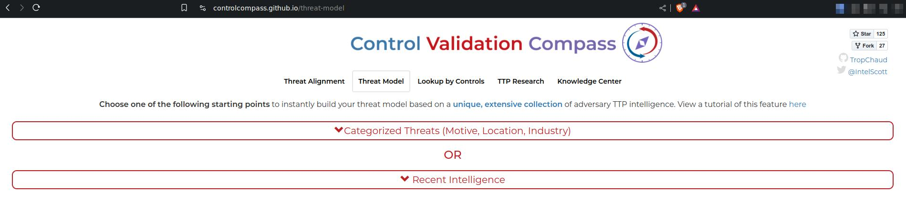

# About

Script #1 takes JSON file generated using [Control Validation Compass](https://controlcompass.github.io/threat-model), strips out TTPs, parses [MITRE Caldera](https://github.com/mitre/caldera) abilities and creates adversary file containing abilities matching CVC threat model file to use with MITRE Caldera adversary simulation software.
It lets you choose platforms for which adversary profile is created. Also you can add custom description. The rest is automatic.

Script #2 creates adversary file containing abilities from techniques and platforms specified by user.

# Requirements

- Installed MITRE Caldera
- JSON file generated with [Control Validation Compass](https://controlcompass.github.io/threat-model)

# Steps

Script assumes that you installed Caldera, enabled Stockpile and Atomic plugins and copied caldera folder into this location. Please check paths in the script before continuing.

1. Go to [Control Validation Compass](https://controlcompass.github.io/threat-model)

2. Create Threat model.

3. Get JSON data

4. Save JSON data as file (in this scripts location).
5. Run automator.sh script

# Final note

For some TTPs, Stockpile and Atomic has created multiple abilities. Depending on the amount of TTPs and chosen platforms you may end up with hundreds of abilities in one adversary file. It's a good idea to review the file via Caldera dashboard and fine-tune the profile.

# Danger!

Do not use adversary profile generated with this script on production machine!
Some abilities may destroy filesystem or do other damage.